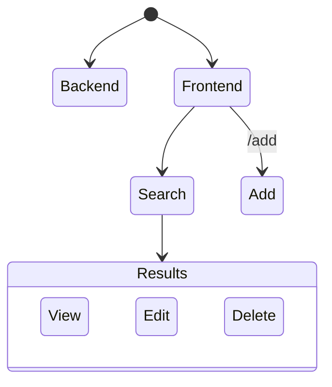
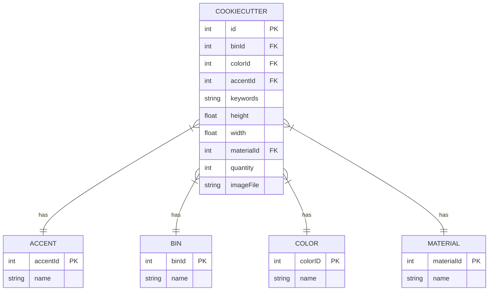

# Mysig Inventory Management Application

## Overview

A CRUD application to track inventory information and location. 

## Backend

The backend uses [axum](https://github.com/tokio-rs/axum) to facilitate [GraphQL](https://github.com/async-graphql/async-graphql) queries against a [Postgres](https://www.postgresql.org/) database via [SeaORM](https://www.sea-ql.org/SeaORM/). The current schema corresponds to the following diagram.

### Migrations

